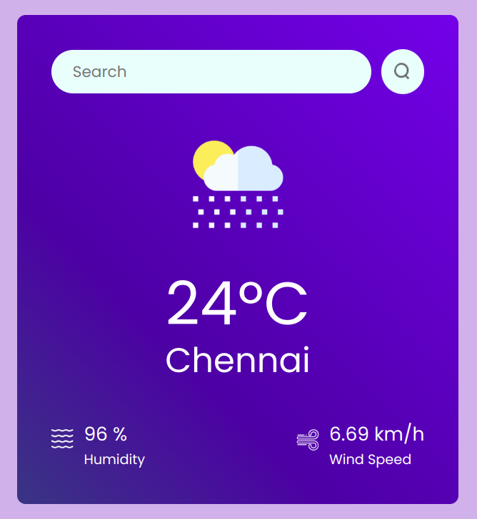

# Please check the master branch for all project files and folders

## WeatherApp

A weather web application using React and Node.js that integrates with external APIs (e.g.,
OpenWeather) to provide real-time weather updates, forecasts, and alerts based on user location and search queries.

## Tech Stack:
React.js, HTML, CSS, Javascript, OpenWeather API.

<!--  -->

